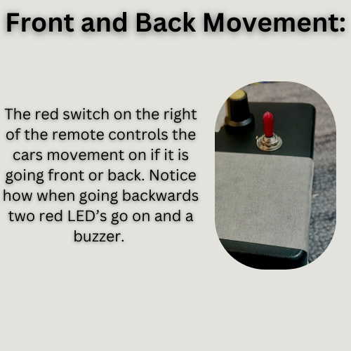
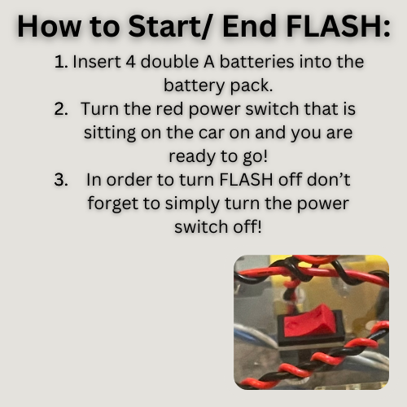
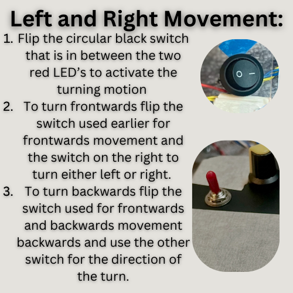
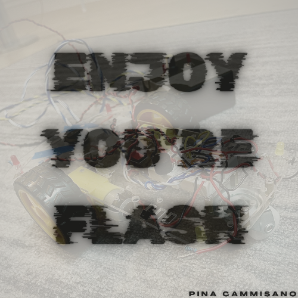

# FLASH — RC Car Remote Control

A hand-built, hand-named remote-controlled car ("FLASH") wired from scratch as a capstone for a circuits/electronics course — built to demonstrate DC motor control, switch logic, and indicator circuits without a microcontroller.

## Overview

FLASH is driven by two DC motors and steered entirely through discrete electronics: two DPDT (double-pole double-throw) switches handle forward/backward and left/right motion, while a set of indicator LEDs and a buzzer give the driver feedback on what the car is doing.

- Two front (yellow) LEDs light up when the car moves forward
- Two rear (red) LEDs light up — along with the buzzer — when the car reverses
- A side LED lights up on the turning side when the car turns
- A handheld remote box houses the switches and potentiometer, powered by 4 AA batteries

A companion Functional Requirements Document ("EkoDrive") reframes the same build as a product: an RC car toy aimed at children aged 6–14, specifying requirements around power (rechargeable batteries), movement (forward/back/left/right), a 30 m control range, a 5-minute auto-shutoff safety feature, collision durability, and non-slip tires.

## How it works

- **Drive:** 2 DC motors mounted on a robot chassis, powered by 4 AA batteries
- **Direction control:** 2 DPDT switches wired to reverse motor polarity for forward/back and left/right
- **Feedback:** 4 LEDs (front/back pairs) + a buzzer, wired directly with soldered resistors
- **Speed/steering feel:** a potentiometer (planned, not completed — see below)
- Circuit was prototyped on a breadboard and simulated in Proteus before final assembly

| | |
|---|---|
|  |  |

## Build notes & challenges

This was a hands-on lesson in wiring discipline as much as electronics theory:

- Reversed polarity between the two DC motors (power/ground soldered on opposite ends) caused early confusion when wiring the drive circuit
- The DPDT switches were re-wired multiple times to get forward/back and left/right behaving independently instead of overlapping
- LED resistors were soldered directly onto the LEDs to save breadboard space, which later caused a wiring rework when both front LEDs ended up firing together on turns
- Ran out of time to wire in the potentiometer and to fix a battery pack fault that came up late in the build; two LEDs also burned out near the end

## Materials

2 DC motors, 1 potentiometer, 2 DPDT switches, remote controller box, 4 AA batteries, resistors, cables/connectors, robot chassis, wheels & axles, motor mounts, screws & fasteners, breadboard, soldering iron & solder, wire strippers/cutters, multimeter, screwdriver. Total build cost: ~$50.

## Contents

- `images/` — real build photos: the assembled car and remote, and the switches/LEDs that drive forward-back and left-right motion
- `docs/final-project-report.docx` — full build report (materials, circuit design, implementation log, conclusion)
- `docs/functional-requirements-ekodrive.docx` — Functional Requirements Document framing the build as the "EkoDrive" RC car toy product

## What I'd do differently

Sketch and fully understand the schematic before touching the breadboard — most of the rework above came from guessing at connections instead of tracing the circuit first. This project's ideas carried forward into a much more advanced build: see [wireless-rc-car-remote-control](https://github.com/Pinacam/wireless-rc-car-remote-control) for a follow-up RC car with a custom PCB, 3D-printed chassis, and full wireless joystick control.
